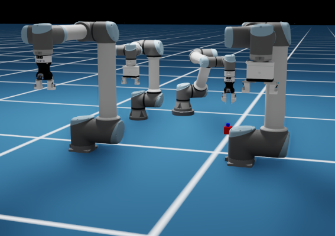

# SDU Core Extension [omni.sdu.core]
ISAAC extension developed by SDU that provides core functionality and utility functions used by other extensions.

## Dependencies
The python dependencies are:
* [numpy](https://pypi.org/project/numpy/)
* [scipy](https://pypi.org/project/scipy/)
* [paho-mqtt](https://pypi.org/project/paho-mqtt/)

## Getting started 
Clone this repository to ~/Documents/Kit/shared/exts or preferred folder with extensions:

    cd ~/Documents/Kit/shared/exts
    git clone git@gitlab.sdu.dk:sdurobotics/novo/omni.sdu.core.git

and finally remember to enable the extension in the omniverse extension manager.